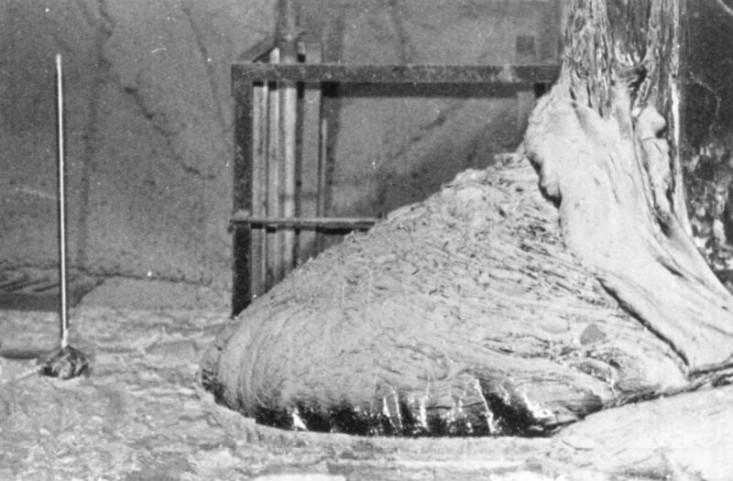

# Chapter 5 - Logarithmic Functions
* [5.1 Logarithms and their Properties](#5.1-logarithms-and-their-properties)
* [5.2 Logarithms and Exponential Models](#5.2-logarithms-and-exponential-models)
* [5.3 The Logarithmic Function](#5.3-the-logarithmic-function)
* [5.4 Logarithmic Scales](#5.4-logarithmic-scales)
* [Chapter 5 Review](#chapter-5-review)

# 5.1 Logarithms and their Properties
## Objectives
* I can convert between exponential and logarithmic statements.
* I can apply the properties of logarithms to solve equations.

# Common Logarithm Function
* If $x$ is a positive number, $\log(x)$ is the exponent of 10 that gives $x$.
* In other words, if $y = \log(x)$ then $10^y = x$.

# Example 1
Rewrite the following statements using exponents instead of logs.

* $\log(4) = 0.602$
* $\log(q) = z$

# Example 2
Evaluate with a calculator.

* $\log(10^7)$
* $10^{\log(5)}$

# Properties of the Common Logarithm
* By definition, $y = \log(x)$ means $10^y = x$. In particular, $\log(1) = 0$ and $\log(10) = 1$.
* The functions $10^x$ and $\log(x)$ are inverses, so they "undo" each other: $\log(10^x) = x$ for all $x$ and $10^{\log(x)} = x$ for $x > 0$.
* For $a$ and $b$ both positive and any value of $t$: $\log(ab) = \log(a) + \log(b)$, $\log\left(\frac{a}{b}\right) = \log(a) - \log(b)$, and $\log(b^t) = t\log(b)$.

# Example 3
Solve the equation using logs.
$$(1.45)^x = 25$$

# The Natural Logarithm
* For $x > 0$, $\ln(x)$ is the power of $e$ that gives $x$. 
* In symbols, $\ln(x) = y$ means $e^y = x$, and $y$ is called the **natural logarithm** of $x$.

# Properties of the Natural Logarithm
* By definition, $y = \ln(x)$ means $x = e^y$. In particular, $\ln 1 = 0$ and $\ln e = 1$.
* The functions $e^x$ and $\ln x$ are inverses, so they "undo" each other: $\ln(e^x) = x$ for all $x$ and $e^{\ln x} = x$ for $x > 0$.
* For $a$ and $b$ both positive and any value of $t$: $\ln (ab) = \ln a + \ln b$, $\ln \left(\frac{a}{b}\right) = \ln a - \ln b$, and $\ln (b^t) = t\ln b$.

# Example 4
Solve the equation using logs.
$$10 = 22(0.87)^q$$

# Assignments
* Day 1 Page 185, 1-17 odd
* Day 2 Page 186, 19-33 odd
* Day 3 Page 187, 35-51 odd (not 45, 51)

# 5.1 Day 2
## Agenda
* Warm-Up Problem
* Day 1 Page 185, 1-17 odd Assignment Questions
* Misconceptions Involving Logs Notes
* Work time

## Objectives
* I can convert between exponential and logarithmic statements.
* I can apply the properties of logarithms to solve equations.

# Warm-Up Problem
Simplify.
$$log(\sqrt{10000})$$

Solve the equation using logs.
$$\frac{2}{7} = (0.6)^{2t}$$

*Properties of the Natural Logarithm*

* The functions $e^x$ and $\ln x$ are inverses, so they "undo" each other: $\ln(e^x) = x$ for all $x$ and $e^{\ln x} = x$ for $x > 0$.
* For $a$ and $b$ both positive and any value of $t$: $\ln (ab) = \ln a + \ln b$, $\ln \left(\frac{a}{b}\right) = \ln a - \ln b$, and $\ln (b^t) = t\ln b$.

# Questions on Page 185, 1-17 odd?

# Misconceptions Involving Logs Notes
* $\log(a+b) \neq \log(a) + \log(b)$
* $\log(a-b) \neq \log(a) - \log(b)$
* $\log(ab) \neq (\log(a))(\log(b))$
* $\log\left(\frac{a}{b}\right) \neq \frac{\log(a)}{\log(b)}$
* $\log\left(\frac{1}{a}\right) \neq \frac{1}{\log(a)}$

# Work time on Assignments
* Day 1 Page 185, 1-17 odd
* Day 2 Page 186, 19-33 odd
* Day 3 Page 187, 35-51 odd (not 45, 51)
* All Due Wednesday

# 5.1 Day 3
## Agenda
* Warm-Up Problem
* Page 186, 19-33 odd Assignment Questions
* Work time

## Objectives
* I can convert between exponential and logarithmic statements.
* I can apply the properties of logarithms to solve equations.

# Warm-Up Problem
1. Use the properties of logarithms to solve for $x$.
$$\log(3(2)^x) = 8$$

2. Solve the equation exactly for $x$.
$$e^{x+5} = 7(2)^x$$

*Properties of the Natural Logarithm*

* The functions $e^x$ and $\ln x$ are inverses, so they "undo" each other: $\ln(e^x) = x$ for all $x$ and $e^{\ln x} = x$ for $x > 0$.
* For $a$ and $b$ both positive and any value of $t$: $\ln (ab) = \ln a + \ln b$, $\ln \left(\frac{a}{b}\right) = \ln a - \ln b$, and $\ln (b^t) = t\ln b$.

# Warm-Up Problem 1 Solution
1. Use the properties of logarithms to solve for $x$.

\begin{align*}
\log(3(2)^x) &= 8 \\
\log(3)+\log(2^x) &= 8 \\
\log(3)+x\log(2) &= 8 \\
x\log(2) &= 8-\log(3) \\
x &= \frac{8-\log(3)}{\log(2)} \\
\end{align*}

# Warm-Up Problem 2 Solution
2. Solve the equation exactly for $x$.

\begin{align*}
e^{x+5} &= 7(2)^x \\
\ln(e^{x+5}) &= \ln(7(2)^x) \\
x+5 &= \ln(7)+\ln((2)^x) \\
x+5 &= \ln(7)+x\ln(2) \\
x-x\ln(2) &= \ln(7)-5 \\
x(1-\ln(2)) &= \ln(7)-5 \\
x &= \frac{\ln(7)-5}{1-\ln(2)}
\end{align*}

# Questions on Page 186, 19-33 odd?

# Work time on Assignments
* Day 1 Page 185, 1-17 odd
* Day 2 Page 186, 19-33 odd
* Day 3 Page 187, 35-51 odd (not 45, 51)
* All Due Tomorrow

# 5.2 Logarithms and Exponential Models
## Objectives
* I can use logarithms to solve exponential equations.
* I can setup an exponential equation to model doubling and half-life.

# Example 1 - Doubling Time
You place 1000 MMK in a KBZ Bank fixed deposit bank account. According to their website, a 1 month term account earns 9% interest, 3 months earns 9.25%, 6 months earns 9.5%, 9 months earns 9.75%, and 12 months earns 10%.

<iframe src="https://www.kbzbank.com/en/accounts/fixed-deposit-account/" style="border:0px #FFFFFF none;" name="myiFrame" scrolling="yes" frameborder="1" marginheight="0px" marginwidth="0px" height="40%" width="100%"></iframe>

* How often is a fixed account compounded at KBZ Bank?
* $\$ 1 \approx 1300$ MMK. If you deposit \$1000000 into the KBZ fixed deposit account with a 12 month term, how much interest would you earn?
* If you open an account with 1000 MMK, how long would it take to double your money with each term account?

# Example 1 - Doubling Time - Solution
You place 1000 MMK in a KBZ Bank fixed deposit bank account. According to their website, a 1 month term account earns 9% interest, 3 months earns 9.25%, 6 months earns 9.5%, 9 months earns 9.75%, and 12 months earns 10%.

* How often is a fixed account compounded at KBZ Bank? Depends on the term. $B = P\left(1+\frac{r}{n}\right)^{nt}$
* $\$ 1 \approx 1300$ MMK. If you deposit \$1,000,000 into the KBZ fixed deposit account with a 12 month term, how much interest would you earn? $P = 1000000$, $t = 1$, $r = 0.1$, $n = 1$, so $B = 1000000\left(1+\frac{0.1}{1}\right)^{1(1)} = 1100000$. This means they earn $100000 in interest.
* If you open an account with 1000 MMK, how long would it take to double your money with each term account?
* 1 month: $n = 12$ and $r = 0.09$, so $2000 = 1000\left(1+\frac{0.09}{12}\right)^{12t}$. $t = \ln(2)/(12\ln\left(1+\frac{0.09}{12}\right)) \approx 7.730$ years.
* 3 months: $n = 4$ and $r = 0.0925$, so $2000 = 1000\left(1+\frac{0.0925}{4}\right)^{4t}$. $t = \ln(2)/(4\ln\left(1+\frac{0.0925}{4}\right)) \approx 7.579$ years.
* 6 months: $n = 2$ and $r = 0.095$, so $2000 = 1000\left(1+\frac{0.095}{2}\right)^{2t}$. $t = \ln(2)/(2\ln\left(1+\frac{0.095}{2}\right)) \approx 7.468$ years.
* 9 months: $n = 12/9$ and $r = 0.0975$, so $2000 = 1000\left(1+\frac{0.0975}{12/9}\right)^{(12/9)t}$. $t = \ln(2)/((12/9)\ln\left(1+\frac{0.0975}{(12/9)}\right)) \approx 7.366$ years.
* 12 months: $n = 1$ and $r = 0.1$, so $2000 = 1000\left(1+\frac{0.1}{1}\right)^{(1)t}$. $t = \ln(2)/(1\ln\left(1+\frac{0.1}{1}\right)) \approx 7.272$ years.

# Example 2 - Half-Life

The Chernobyl expolosion in 1986 initially had a radiation reading of 300 Sv/hr near the reactor core. After 22 years, the radiation levels inside the reactor hall were about 34 Sv/hr. More than half of people exponsed to 5 Sv will die from the radiation.

* What is the rate at which the radiation is decaying? Assume exponential decay.
* How long was it until half the radiation remained?
* How long would it take to receive a lethal dose of radiation in the reactor hall today?

# Example 2 - Half-Life - Solution

The Chernobyl expolosion in 1986 initially had a radiation reading of 300 Sv/hr near the reactor core. After 22 years, the radiation levels inside the reactor hall were about 34 Sv/hr. More than half of people exponsed to 5 Sv will die from the radiation.

* What is the rate at which the radiation is decaying? Assume exponential decay. $34 = 300e^{k(22)}$, so $k = \ln(34/300)/22 \approx -0.098973725$, so down by 9.897%.
* How long was it until half the radiation remained? $150 = 300e^{-0.098973725t}$, so $t = \ln(150/300)/(-0.098973725) \approx 7.003345388$ years.
* How long would it take to receive a lethal dose of radiation in the reactor hall today? $Sv = 300e^{-0.098973725(30)} \approx 15.40312983$, so 15 Sv/hr would mean 5 Sv in 20 minutes.

# Converting Between $Q = ab^t$ and $Q = ae^{kt}$
Any exponential function can be written in either of the two forms:
$$Q = ab^t \text{ or } Q = ae^{kt}$$
If $b = e^k$, so $k = \ln(b)$, the two formulas represent the same function.

# Example 3
Convert to the form $Q = ab^t$.
$$Q = 0.3e^{0.7t}$$

# Example 3 - Solution
Convert to the form $Q = ab^t$.
$$Q = 0.3e^{0.7t} = 0.3(e^{0.7})^t \approx 0.3(2.01375)^t$$

# Example 4
Convert to the form $Q = ae^{kt}$. Give the starting value $a$, the growth rate $r$, and the continuous growth rate $k$.
$$Q = 5(2)^{t/8}$$

# Example 4
Convert to the form $Q = ae^{kt}$. Give the starting value $a$, the growth rate $r$, and the continuous growth rate $k$.

$Q = 5(2)^{t/8} = 5\left(2^{\frac{1}{8}}\right)^t$, so $e^k = 2^{\frac{1}{8}}$ and then $k = \ln\left(2^{\frac{1}{8}}\right) \approx 0.08664$. Thus, $Q = 5e^{0.08664t}$.

# 5.2 Assignments and 5.1 Homework Check
* Homework Check: 5.1, Page 185, 1-51 odd (not 45, 51)
* Day 1, Page 194, 1-19 odd
* Day 2, Page 194, 21-51 odd (not 43)
* 5.2 Assignments are due Monday

# 5.2 Assignment Questions?
* Day 1, Page 194, 1-19 odd
* Day 2, Page 194, 21-51 odd (not 43)
* 5.2 Assignments are due Monday

# 5.3 The Logarithmic Function
## Agenda
* Homework Check: 5.2 Page 194, 1-51 odd (not 43)
* 5.3 Notes
* Work time

## Objectives
* I can graph $\log(x)$ and $\ln(x)$ using their inverse functions.
* I can solve word problems involving chemical acidity, decibals, and orders of magnitude.

# The Graph, Domain, and Range of the Common Logarithm
$\log(x)$ is the inverse of $10^x$, so the graph of $\log(x)$ is the reflection across $y = x$ of $10^x$.

\begin{tikzpicture}
\begin{axis}[xlabel={$x$},ylabel={$y$},axis lines=middle,xmin=-2,xmax=11,ymin=-2,ymax=11]
\addplot[blue,no marks,samples=200,domain=-1:10] {log10(x)} node[above,pos=1] {$y = \log(x)$};
\addplot[red,no marks,samples=200,domain=-1:1] {10^x} node[above,pos=1] {$y = 10^x$};
\addplot[dashed,domain=-1:10] {x} node[above,pos=1] {$y = x$};
\end{axis}
\end{tikzpicture}

The domain of $y = 10^x$ is all real numbers and the range is all positive real numbers.
The domain of $y = \log(x)$ is all positive real numbers and the range is all real numbers.

# Graph of Natural Logarithm
The graph of $y = \ln(x)$ is similar to the graph of $y = \log(x)$, except it is the reflection across $y = x$ of $y = e^x$ instead of $y = 10^x$.

# Example 1
Sketch the graph $y = \ln(x)$ for $0 < x < 10$ by hand.

# Chemical Acidity
$$pH = -\log\left[H^+\right]$$
where $pH$ is the acidity of a liquid and $\left[H^+\right]$ is the hydrogen ion concentration.

# Example 2
Find the hydrogen ion concentration, $\left[H^+\right]$, for Lye, with a $pH$ of 13.

# Logarithms and Orders of Magnitude
If one object is 10 times heavier than another, we say it is an *order of magnitude* heavier. For example, the value of a dollar is two orders of magnitude greater than the value of a penny, because we have
$$\frac{\$1}{\$0.01} = 100 = 10^2$$
The order of magnitude is the logarithm of their ratio.

# Example 3
The diameter of the earth is about 12,742 km. The diameter of the observable universe is about 93 Gly. How many orders of magnitude larger is the diameter of the observable universe than the diameter of the earth? 1 ly is about 9.461 trillion km.

# Decibels
$$\text{Noise level in decibels} = 10\cdot\log\left(\frac{I}{I_0}\right).$$
where $I$ is the sound's intensity and $I_0$ is the intensity of a standard sound. The intensity of $I_0$ is defined to be $10^{-16}$ watts/cm$^2$.

# Example 4
The noise level of a whisper is 30 $dB$. Compute the sound intensity of a whisper.

# Asymptotes and Limit Notation
Let $y = f(x)$ be a function and let $a$ be a finite number.

* The graph of $f$ has a **horizontal asymptote** of $y = a$ if
$$\lim_{x \to \infty} f(x) = a \text{ or } \lim_{x \to -\infty} f(x) = a \text{ or both.}$$
* The graph of $f$ has a **vertical asymptote** of $x = a$ if
$$\lim_{x \to a^+} f(x) = \infty \text{ or } \lim_{x \to a^+} f(x) = -\infty \text{ or } \lim_{x \to a^-} f(x) = \infty \text{ or } \lim_{x \to a^-} f(x) = -\infty$$

# 5.3 Assignments
* Day 1, Page 203, 1-13 odd
* Day 2, Page 203, 15-39 odd (#33 look at #32)
* Due Wednesday
* 5.2 Assignment will be checked tomorrow.

# 5.3 Assignment Questions?
* Day 1, Page 203, 1-13 odd
* Day 2, Page 203, 15-39 odd (#33 look at #32)
* 5.3 Assignments are due tomorrow.
* 5.2 Assignment, Page 194, 1-51 odd (not 43) will be checked today.

# 5.4 Logarithmic Scales

# Chapter 5 Review
